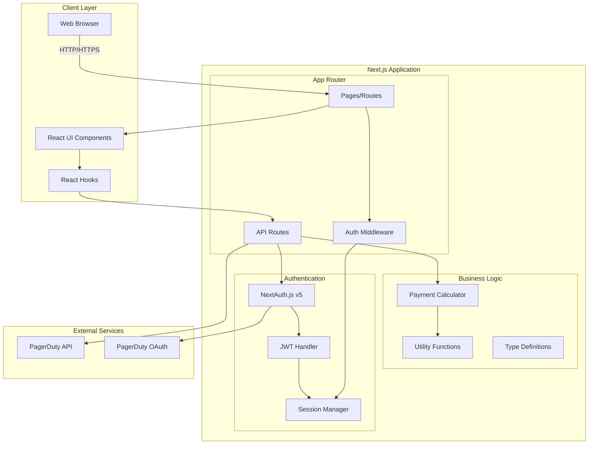
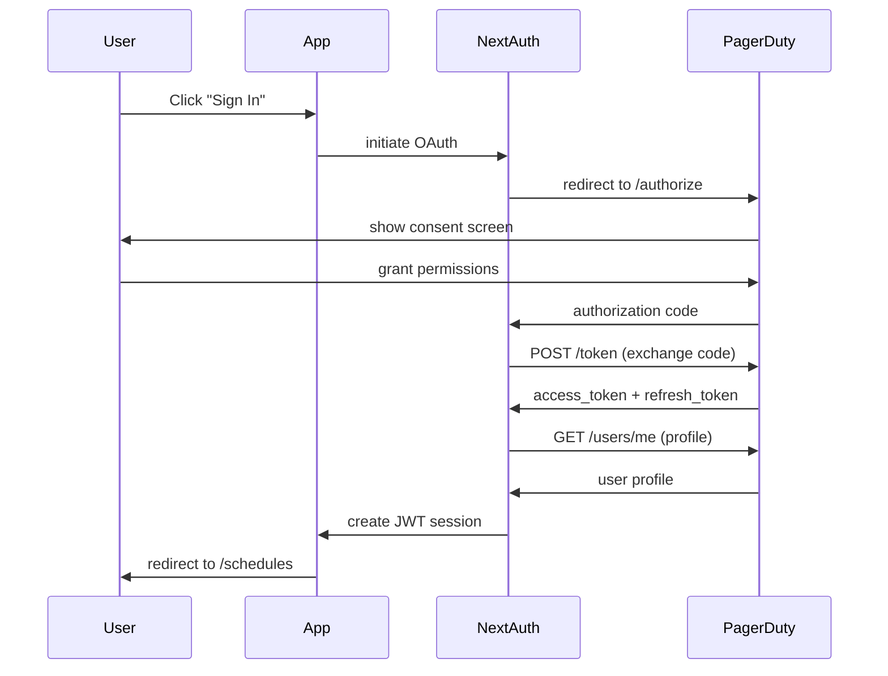
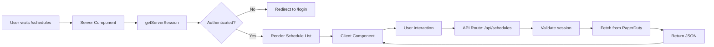
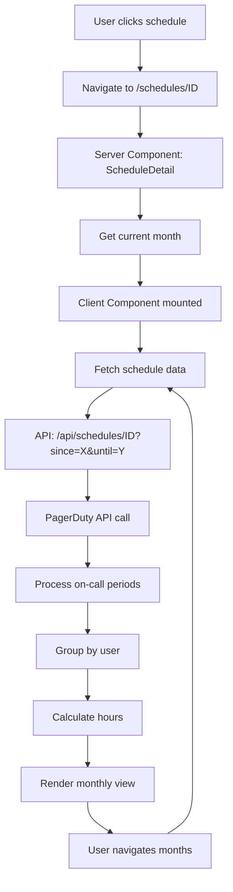
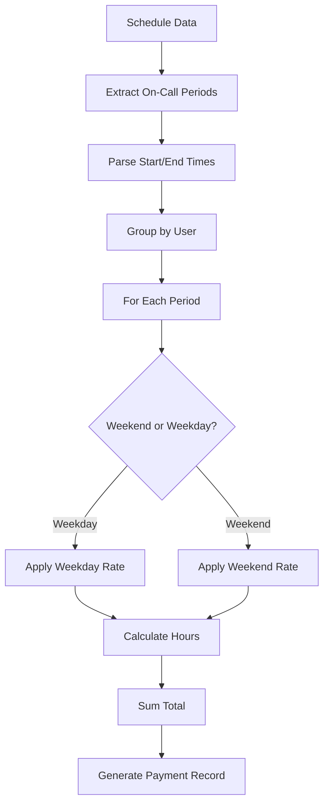

# CaloohPay System Architecture

This document describes the system architecture, design decisions, and technical patterns used in the CaloohPay application.

## Table of Contents

- [System Overview](#system-overview)
- [Architecture Diagram](#architecture-diagram)
- [Technology Stack](#technology-stack)
- [Application Architecture](#application-architecture)
- [Authentication Architecture](#authentication-architecture)
- [Data Flow](#data-flow)
- [Component Architecture](#component-architecture)
- [API Integration](#api-integration)
- [Payment Calculation Engine](#payment-calculation-engine)
- [State Management](#state-management)
- [Testing Architecture](#testing-architecture)
- [Design Decisions](#design-decisions)
- [Security Considerations](#security-considerations)
- [Performance Optimizations](#performance-optimizations)
- [Future Considerations](#future-considerations)

## System Overview

CaloohPay is a web application that calculates on-call payments for PagerDuty schedules. It provides a user-friendly interface for viewing schedules, calculating compensation based on on-call periods, and exporting payment data.

### Key Features

- **PagerDuty OAuth Integration**: Secure authentication using PagerDuty as identity provider
- **Schedule Management**: Browse and view PagerDuty schedules with detailed monthly views
- **Payment Calculation**: Calculate on-call compensation based on weekday/weekend rates
- **Data Export**: Export payment calculations to CSV format
- **Responsive Design**: Mobile-first design with dark mode support

### User Workflow

1. User signs in with PagerDuty OAuth
2. Browse available on-call schedules
3. Select a schedule to view monthly on-call periods
4. Navigate through different months
5. Calculate payments for specific periods
6. Export payment data to CSV

## Architecture Diagram



## Technology Stack

### Core Framework

- **Next.js 14**: React framework with App Router
  - Server-side rendering (SSR)
  - API routes
  - File-based routing
  - Middleware support
  - Server Components by default

### Frontend

- **React 18**: UI library with concurrent features
- **TypeScript**: Type-safe development
- **Tailwind CSS**: Utility-first styling
- **Luxon**: Date/time manipulation (timezone-aware)

### Authentication

- **NextAuth.js v5**: OAuth 2.0 implementation
  - JWT session strategy
  - Token refresh mechanism
  - PagerDuty provider

### Development Tools

- **ESLint**: Code linting
- **Prettier**: Code formatting
- **Husky**: Git hooks
- **Commitlint**: Commit message validation

### Testing

- **Jest**: Unit testing framework
- **React Testing Library**: Component testing
- **Playwright**: End-to-end testing

### Deployment

- **Vercel/AWS Amplify**: Hosting platform (planned)
- **Environment Variables**: Configuration management

## Application Architecture

### Next.js App Router Structure

CaloohPay uses Next.js 14's App Router architecture:

```
src/app/
├── api/                    # API Routes
│   ├── auth/              # NextAuth endpoints
│   │   └── [...nextauth]/ # Dynamic auth routes
│   └── schedules/         # Schedule APIs
│       ├── route.ts       # List schedules
│       └── [id]/          # Schedule detail
│           └── route.ts   # Get schedule by ID
├── schedules/             # Schedule pages
│   ├── page.tsx          # Schedule list
│   └── [id]/             # Dynamic schedule detail
│       └── page.tsx      # Schedule detail view
├── login/                 # Login page
│   └── page.tsx
├── layout.tsx            # Root layout
└── page.tsx              # Home page
```

### Routing Strategy

**File-based Routing**: Leverages Next.js conventions

- `page.tsx` - Defines a route
- `layout.tsx` - Defines shared layout
- `route.ts` - Defines API endpoints
- `[param]` - Dynamic route segments

**Route Protection**: Middleware-based authentication

```typescript
// middleware.ts
export { default } from 'next-auth/middleware';

export const config = {
  matcher: ['/schedules/:path*', '/payments/:path*'],
};
```

### Server vs Client Components

**Default: Server Components**

- Better performance (no client-side JavaScript)
- Direct database/API access
- Automatic code splitting

**Client Components**: Only when needed

- Interactive UI (buttons, forms)
- Browser APIs (localStorage, window)
- React hooks (useState, useEffect)
- Event handlers

```typescript
// Server Component (default)
export default async function SchedulesPage() {
  const schedules = await fetchSchedules();
  return <ScheduleList schedules={schedules} />;
}

// Client Component (explicit)
'use client';

export default function SearchBar() {
  const [query, setQuery] = useState('');
  return <input onChange={(e) => setQuery(e.target.value)} />;
}
```

## Authentication Architecture

### OAuth 2.0 Flow



### JWT Session Strategy

**Why JWT over Database Sessions?**

1. **Stateless**: No database required
2. **Scalable**: Works across multiple servers
3. **Serverless-friendly**: Compatible with edge functions
4. **Fast**: No database lookups

**JWT Token Structure**:

```typescript
{
  accessToken: string;        // PagerDuty OAuth token
  refreshToken?: string;       // For token refresh
  accessTokenExpires: number;  // Expiration timestamp
  user: {
    id: string;
    email: string;
    name: string;
  };
}
```

### Token Refresh Mechanism

Automatic token refresh prevents users from being logged out:

```typescript
async function refreshAccessToken(token: JWT) {
  try {
    // Call PagerDuty token endpoint
    const response = await fetch('https://identity.pagerduty.com/oauth/token', {
      method: 'POST',
      body: new URLSearchParams({
        grant_type: 'refresh_token',
        refresh_token: token.refreshToken,
        client_id: process.env.PAGERDUTY_CLIENT_ID,
        client_secret: process.env.PAGERDUTY_CLIENT_SECRET,
      }),
    });

    const refreshedTokens = await response.json();

    // Update token with new values
    return {
      ...token,
      accessToken: refreshedTokens.access_token,
      accessTokenExpires: Date.now() + refreshedTokens.expires_in * 1000,
    };
  } catch (error) {
    return { ...token, error: 'RefreshAccessTokenError' };
  }
}
```

## Data Flow

### Schedule Listing Flow



### Schedule Detail Flow



## Component Architecture

### Component Hierarchy

```
App Layout
├── SessionProvider (Context)
│   ├── ThemeProvider (Context)
│   │   ├── Header (Common)
│   │   │   └── Navigation
│   │   ├── Page Content
│   │   │   ├── Schedule List
│   │   │   │   ├── SearchBar (Client)
│   │   │   │   └── ScheduleCard[]
│   │   │   └── Schedule Detail
│   │   │       ├── MonthNavigation (Client)
│   │   │       ├── OnCallPeriodList
│   │   │       └── PaymentCalculator (Client)
│   │   └── Footer (Common)
└── ErrorBoundary
```

### Common Components

Located in `src/components/common/`:

- **Card**: Reusable card container
- **ErrorBoundary**: Error catching and display
- **ErrorDisplay**: Error message component
- **Header**: Navigation bar with auth status
- **Footer**: App footer
- **Loading**: Loading spinner

### Design Patterns

**Composition over Inheritance**:

```typescript
// Card component for reusability
export function Card({ children, className }: CardProps) {
  return <div className={`bg-white rounded shadow ${className}`}>{children}</div>;
}

// Usage in different contexts
<Card className="p-6">
  <ScheduleInfo />
</Card>
```

**Separation of Concerns**:

- **Presentational Components**: UI only, no logic
- **Container Components**: Data fetching and state
- **Custom Hooks**: Reusable logic extraction

## API Integration

### PagerDuty API Client

**Base Configuration**:

```typescript
// src/lib/api/pagerduty.ts
const PAGERDUTY_API_BASE = 'https://api.pagerduty.com';

async function fetchPagerDuty(endpoint: string, token: string) {
  const response = await fetch(`${PAGERDUTY_API_BASE}${endpoint}`, {
    headers: {
      Authorization: `Bearer ${token}`,
      Accept: 'application/vnd.pagerduty+json;version=2',
    },
  });

  if (!response.ok) {
    throw new Error('PagerDuty API error');
  }

  return response.json();
}
```

### API Route Pattern

**Standard API Route Structure**:

```typescript
// src/app/api/schedules/route.ts
import { getServerSession } from 'next-auth';
import { NextResponse } from 'next/server';

export async function GET(request: Request) {
  // 1. Authenticate
  const session = await getServerSession(authOptions);
  if (!session?.accessToken) {
    return NextResponse.json({ error: 'Unauthorized' }, { status: 401 });
  }

  // 2. Process request
  const { searchParams } = new URL(request.url);
  const query = searchParams.get('query');

  // 3. Call external API
  try {
    const data = await fetchPagerDuty('/schedules', session.accessToken);

    // 4. Return response
    return NextResponse.json(data);
  } catch (error) {
    return NextResponse.json({ error: 'Internal server error' }, { status: 500 });
  }
}
```

### Error Handling Strategy

**Layered Error Handling**:

1. **API Route Level**: Catch and return appropriate HTTP status
2. **Client Level**: Display user-friendly error messages
3. **Error Boundary**: Catch React errors

```typescript
// Client-side error handling
try {
  const response = await fetch('/api/schedules');
  if (!response.ok) {
    if (response.status === 401) {
      // Handle unauthorized
      router.push('/login');
    } else {
      // Handle other errors
      setError('Failed to load schedules');
    }
  }
  const data = await response.json();
} catch (error) {
  setError('Network error');
}
```

## Payment Calculation Engine

### Architecture

The payment calculation engine is ported from the original CalOohPay Python implementation:

```
src/lib/calculations/
├── PaymentCalculator.ts   # Main calculation logic
├── OnCallPeriod.ts        # On-call period model
└── OnCallUser.ts          # User aggregation model
```

### Calculation Flow



### Rate Configuration

**Configurable Rates** (in `src/lib/constants.ts`):

```typescript
export const PAYMENT_RATES = {
  WEEKDAY_RATE: 25, // $25/hour for weekdays
  WEEKEND_RATE: 40, // $40/hour for weekends
  WEEKDAY_HOURS: [1, 2, 3, 4, 5], // Monday-Friday
  WEEKEND_HOURS: [6, 0], // Saturday-Sunday
};
```

### Payment Calculator Class

```typescript
class PaymentCalculator {
  calculatePayment(period: OnCallPeriod): Payment {
    const hours = this.calculateHours(period.start, period.end);
    const isWeekend = this.isWeekend(period.start);
    const rate = isWeekend ? WEEKEND_RATE : WEEKDAY_RATE;

    return {
      hours,
      rate,
      amount: hours * rate,
      period: {
        start: period.start,
        end: period.end,
      },
    };
  }

  private calculateHours(start: DateTime, end: DateTime): number {
    return end.diff(start, 'hours').hours;
  }

  private isWeekend(date: DateTime): boolean {
    return [6, 7].includes(date.weekday); // Luxon: 6=Saturday, 7=Sunday
  }
}
```

### Timezone Handling

**Using Luxon for Timezone Awareness**:

```typescript
import { DateTime } from 'luxon';

// Parse PagerDuty timestamps with timezone
const start = DateTime.fromISO(period.start, {
  zone: schedule.time_zone, // e.g., "America/New_York"
});

// Calculate in schedule's timezone
const hours = end.diff(start, 'hours').hours;

// Format for display
const formatted = start.toLocaleString(DateTime.DATETIME_MED);
```

## State Management

### Strategy: Minimal State Management

**Server State**: Managed by Next.js and React

- Server Components fetch data directly
- No global state management library needed
- React Context for theme and session

**Client State**: React hooks for local state

```typescript
const [schedules, setSchedules] = useState<Schedule[]>([]);
const [loading, setLoading] = useState(true);
const [error, setError] = useState<string | null>(null);
```

### Context Providers

**SessionProvider**: Authentication state

```typescript
// src/context/SessionProvider.tsx
'use client';

import { SessionProvider as NextAuthSessionProvider } from 'next-auth/react';

export default function SessionProvider({ children }) {
  return <NextAuthSessionProvider>{children}</NextAuthSessionProvider>;
}
```

**ThemeProvider**: Dark mode state

```typescript
// src/context/ThemeContext.tsx
const ThemeContext = createContext<ThemeContextType>({
  theme: 'light',
  toggleTheme: () => {},
});

export function ThemeProvider({ children }) {
  const [theme, setTheme] = useState<'light' | 'dark'>('light');

  const toggleTheme = () => {
    setTheme((prev) => (prev === 'light' ? 'dark' : 'light'));
  };

  return (
    <ThemeContext.Provider value={{ theme, toggleTheme }}>
      {children}
    </ThemeContext.Provider>
  );
}
```

## Testing Architecture

### Testing Pyramid

```
        /\
       /  \
      / E2E \
     /--------\
    /  API     \
   /------------\
  /   Unit Tests \
 /________________\
```

**Unit Tests (Base)**: 22 tests

- Authentication logic (14 tests)
- API routes (8 tests)
- Utility functions
- Payment calculations

**Integration Tests (Middle)**: Planned

- Component integration
- API integration

**E2E Tests (Top)**: Implemented

- Authentication flow
- Schedule browsing flow

### Unit Testing Strategy

**Jest + React Testing Library**:

```typescript
// src/app/api/schedules/__tests__/route.test.ts
describe('/api/schedules', () => {
  it('should return 401 when user is not authenticated', async () => {
    getServerSession.mockResolvedValue(null);

    const response = await GET(createMockRequest('...'));

    expect(response.status).toBe(401);
  });

  it('should fetch schedules from PagerDuty successfully', async () => {
    getServerSession.mockResolvedValue({ accessToken: 'token' });
    global.fetch.mockResolvedValue({
      ok: true,
      json: async () => ({ schedules: [...] }),
    });

    const response = await GET(createMockRequest('...'));

    expect(response.status).toBe(200);
  });
});
```

### E2E Testing Strategy

**Playwright**:

```typescript
// tests/e2e/schedules.spec.ts
test('user can view schedule list', async ({ page }) => {
  await page.goto('/schedules');
  await expect(page.locator('h1')).toContainText('Schedules');
  await expect(page.locator('[data-testid="schedule-card"]')).toBeVisible();
});
```

### Mocking Strategy

**API Mocking**:

- Mock `NextResponse.json()` for API routes
- Mock `global.fetch` for external API calls
- Mock `getServerSession` for authentication

**Component Mocking**:

- Mock Next.js router
- Mock NextAuth hooks
- Mock external dependencies

## Design Decisions

### 1. Next.js 14 App Router vs Pages Router

**Decision**: Use App Router

**Rationale**:

- Modern React patterns (Server Components)
- Better performance (less client-side JavaScript)
- Improved SEO capabilities
- Aligned with Next.js future direction
- Built-in layouts and error boundaries

**Trade-offs**:

- ✅ Better performance and DX
- ⚠️ Newer paradigm (some community resources still use Pages Router)

### 2. JWT Sessions vs Database Sessions

**Decision**: JWT sessions

**Rationale**:

- Stateless authentication
- No database required
- Serverless-friendly
- Easy horizontal scaling

**Trade-offs**:

- ✅ Simpler architecture
- ⚠️ Cannot immediately invalidate sessions
- ⚠️ Token size considerations

### 3. Tailwind CSS vs CSS-in-JS

**Decision**: Tailwind CSS

**Rationale**:

- Utility-first approach
- Smaller bundle size
- Faster development
- Built-in responsive design
- No runtime overhead

**Trade-offs**:

- ✅ Fast development, small bundles
- ⚠️ Verbose HTML classes
- ⚠️ Learning curve for new developers

### 4. Luxon vs date-fns vs Moment

**Decision**: Luxon

**Rationale**:

- Immutable date handling
- Built-in timezone support
- Modern API
- Smaller than Moment
- Better TypeScript support than date-fns

**Trade-offs**:

- ✅ Best timezone support
- ⚠️ Slightly larger than date-fns

### 5. TypeScript Strict Mode

**Decision**: Enable strict mode

**Rationale**:

- Catch errors at compile time
- Better IDE support
- Self-documenting code
- Easier refactoring

**Trade-offs**:

- ✅ Fewer runtime errors
- ⚠️ More initial development time

### 6. Monorepo vs Single Repository

**Decision**: Single repository

**Rationale**:

- Simpler setup for web-only application
- No need for shared packages (yet)
- Easier deployment

**Future Consideration**: May migrate to monorepo if mobile app is added

### 7. Client-Side vs Server-Side Data Fetching

**Decision**: Prefer server-side

**Rationale**:

- Better initial page load
- SEO benefits
- Direct API access
- Reduced client-side JavaScript

**Exception**: Use client-side for:

- Real-time updates
- User interactions
- Optimistic updates

## Security Considerations

### Authentication Security

1. **OAuth 2.0**: Industry-standard authentication
2. **JWT Encryption**: Sessions encrypted with `NEXTAUTH_SECRET`
3. **Secure Cookies**: HttpOnly, Secure flags in production
4. **Token Refresh**: Automatic token renewal
5. **Session Expiration**: Tokens expire when not refreshable

### API Security

1. **Authentication Required**: All API routes check session
2. **No Token Exposure**: Access tokens not sent to client
3. **Input Validation**: Query parameters validated
4. **Error Sanitization**: Error messages don't leak sensitive info

### Environment Variables

1. **Secret Management**: Secrets in `.env.local` (gitignored)
2. **Production Secrets**: Use hosting provider's secret management
3. **No Hardcoded Secrets**: All sensitive data in environment

### CORS and CSP

1. **Same-Origin Policy**: API routes same domain as frontend
2. **CSRF Protection**: Built-in Next.js CSRF protection
3. **CSP Headers**: Configure in production

## Performance Optimizations

### Server-Side Rendering

- Initial page load with data
- Reduced Time to Interactive (TTI)
- Better perceived performance

### Code Splitting

- Automatic route-based splitting
- Dynamic imports for heavy components
- Smaller initial bundles

### Image Optimization

- Next.js Image component (planned)
- Automatic WebP conversion
- Lazy loading

### Caching Strategy

**Current**: No caching (always fresh data)

**Future Considerations**:

- Cache PagerDuty API responses (5-10 minutes)
- Use SWR or React Query for client-side caching
- Add Redis for server-side caching

### Bundle Size Optimization

- Tree shaking enabled
- Production builds minified
- Unused code eliminated

## Future Considerations

### Scalability

**Current Scale**: Single-team usage

**Future Scaling Needs**:

- Multiple organizations
- Multi-tenancy
- Database for caching/analytics
- Rate limiting

### Feature Roadmap

1. **Payment Calculation UI** (Next Priority)
   - Integrate calculator with detail page
   - Display payment breakdown
   - Show weekday/weekend hours

2. **Data Export** (High Priority)
   - CSV export implemented
   - Add PDF reports
   - Email reports

3. **Historical Data** (Medium Priority)
   - Store calculation history
   - Compare periods
   - Analytics dashboard

4. **Multi-Schedule Calculations** (Low Priority)
   - Calculate across multiple schedules
   - Bulk operations
   - Team-level views

### Technical Debt

1. **Test Coverage**: Increase to >80%
2. **E2E Tests**: Expand coverage
3. **Error Handling**: Improve error boundaries
4. **Loading States**: Better loading UX
5. **Accessibility**: WCAG 2.1 AA compliance

### Monitoring and Observability

**Planned Additions**:

- Error tracking (Sentry)
- Performance monitoring (Vercel Analytics)
- User analytics (Privacy-focused)
- API rate limit monitoring

### Infrastructure

**Current**: Development only

**Production Needs**:

- CI/CD pipeline (GitHub Actions)
- Automated testing in CI
- Preview deployments
- Environment management
- Secrets management

## Conclusion

CaloohPay's architecture prioritizes:

1. **Developer Experience**: Modern tooling, TypeScript, clear patterns
2. **Performance**: Server-side rendering, minimal JavaScript
3. **Security**: OAuth 2.0, JWT sessions, secure defaults
4. **Maintainability**: Clear separation of concerns, comprehensive tests
5. **Scalability**: Stateless architecture, serverless-ready

The architecture supports the current feature set while remaining flexible for future enhancements. Design decisions favor simplicity and modern best practices, with clear trade-offs documented for future reference.

---

**Document Version**: 1.0  
**Last Updated**: November 2024  
**Maintained By**: CaloohPay Contributors
