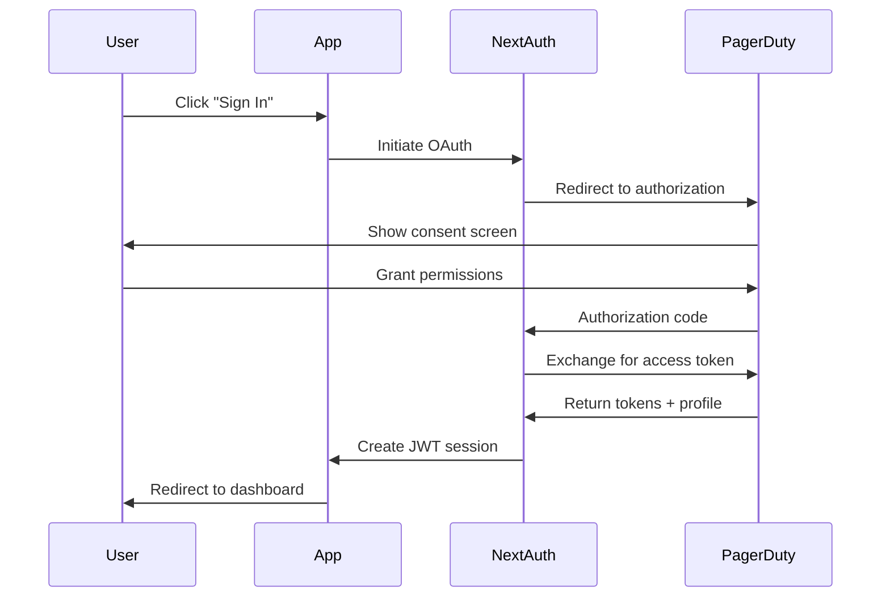

# NextAuth.js Configuration Guide

This document explains the NextAuth.js v5 authentication configuration used in the CaloohPay application, including the OAuth integration with PagerDuty, JWT strategy, token refresh mechanism, and session management.

## Table of Contents

- [Overview](#overview)
- [Authentication Flow](#authentication-flow)
- [Configuration Structure](#configuration-structure)
- [JWT Strategy](#jwt-strategy)
- [Token Refresh Mechanism](#token-refresh-mechanism)
- [Session Management](#session-management)
- [Middleware Protection](#middleware-protection)
- [API Route Protection](#api-route-protection)
- [Client-Side Authentication](#client-side-authentication)
- [Troubleshooting](#troubleshooting)

## Overview

CaloohPay uses NextAuth.js v5 for authentication with the following features:

- **OAuth 2.0** with PagerDuty as the identity provider
- **JWT-based sessions** for stateless authentication
- **Automatic token refresh** to maintain user sessions
- **Middleware protection** for secure routes
- **Type-safe** session and user data

### Key Files

- `/src/lib/auth/options.ts` - NextAuth configuration and options
- `/src/app/api/auth/[...nextauth]/route.ts` - NextAuth API route handler
- `/src/middleware.ts` - Route protection middleware
- `/src/types/next-auth.d.ts` - TypeScript type definitions

## Authentication Flow



### Step-by-Step Flow

1. **User Initiates Sign-In**: User clicks "Sign in with PagerDuty"
2. **OAuth Redirect**: NextAuth redirects to PagerDuty authorization page
3. **User Consent**: User grants permissions to the application
4. **Token Exchange**: NextAuth exchanges authorization code for access token
5. **Profile Retrieval**: NextAuth fetches user profile from PagerDuty
6. **Session Creation**: JWT token is created with user data and access token
7. **Cookie Storage**: Encrypted session cookie is set in the browser

## Configuration Structure

The NextAuth configuration is defined in `/src/lib/auth/options.ts`:

```typescript
export const authOptions: NextAuthConfig = {
  providers: [
    PagerDutyProvider({
      clientId: process.env.PAGERDUTY_CLIENT_ID!,
      clientSecret: process.env.PAGERDUTY_CLIENT_SECRET!,
    }),
  ],
  session: {
    strategy: 'jwt',
  },
  callbacks: {
    async jwt({ token, account, profile }) {
      // Token handling logic
    },
    async session({ session, token }) {
      // Session creation logic
    },
  },
};
```

### Provider Configuration

The PagerDuty OAuth provider requires:

```typescript
PagerDutyProvider({
  clientId: process.env.PAGERDUTY_CLIENT_ID!,
  clientSecret: process.env.PAGERDUTY_CLIENT_SECRET!,
});
```

**Environment Variables Required**:

- `PAGERDUTY_CLIENT_ID` - OAuth application client ID
- `PAGERDUTY_CLIENT_SECRET` - OAuth application client secret
- `NEXTAUTH_URL` - Base URL of your application
- `NEXTAUTH_SECRET` - Secret for encrypting session cookies

See the [PagerDuty OAuth Setup Guide](../setup/pagerduty-oauth-setup.md) for obtaining these credentials.

## JWT Strategy

CaloohPay uses JWT (JSON Web Token) strategy instead of database sessions:

```typescript
session: {
  strategy: 'jwt',
}
```

### Why JWT?

**Advantages**:

- ✅ **Stateless**: No database required for session storage
- ✅ **Scalable**: Works across multiple servers without shared state
- ✅ **Fast**: No database lookups for every request
- ✅ **Portable**: Works with serverless deployments

**Considerations**:

- ⚠️ Sessions cannot be immediately invalidated (rely on expiration)
- ⚠️ Token size increases with more stored data
- ⚠️ Sensitive data should not be stored in JWT

### JWT Callback

The `jwt` callback runs whenever a JWT is created or updated:

```typescript
async jwt({ token, account, profile }) {
  // Initial sign in - store OAuth tokens
  if (account && profile) {
    token.accessToken = account.access_token;
    token.refreshToken = account.refresh_token;
    token.accessTokenExpires = account.expires_at ? account.expires_at * 1000 : 0;
    token.user = {
      id: profile.id,
      email: profile.email,
      name: profile.name,
    };
  }

  // Check if token needs refresh
  if (Date.now() < (token.accessTokenExpires as number)) {
    return token; // Token still valid
  }

  // Refresh the token
  return refreshAccessToken(token);
}
```

### Token Structure

The JWT token contains:

```typescript
{
  accessToken: string;        // PagerDuty OAuth access token
  refreshToken?: string;       // PagerDuty refresh token
  accessTokenExpires: number;  // Expiration timestamp
  user: {
    id: string;
    email: string;
    name: string;
  };
}
```

## Token Refresh Mechanism

When the PagerDuty access token expires, NextAuth automatically refreshes it:

```typescript
async function refreshAccessToken(token: JWT) {
  try {
    const response = await fetch('https://identity.pagerduty.com/oauth/token', {
      method: 'POST',
      headers: { 'Content-Type': 'application/x-www-form-urlencoded' },
      body: new URLSearchParams({
        client_id: process.env.PAGERDUTY_CLIENT_ID!,
        client_secret: process.env.PAGERDUTY_CLIENT_SECRET!,
        grant_type: 'refresh_token',
        refresh_token: token.refreshToken as string,
      }),
    });

    const refreshedTokens = await response.json();

    return {
      ...token,
      accessToken: refreshedTokens.access_token,
      accessTokenExpires: Date.now() + refreshedTokens.expires_in * 1000,
      refreshToken: refreshedTokens.refresh_token ?? token.refreshToken,
    };
  } catch (error) {
    return {
      ...token,
      error: 'RefreshAccessTokenError',
    };
  }
}
```

### Refresh Flow

1. **Token Expiration Check**: On every request, check if token is expired
2. **Refresh Request**: If expired, make POST request to PagerDuty token endpoint
3. **Token Update**: Update JWT with new access token and expiration
4. **Error Handling**: If refresh fails, mark token with error
5. **User Re-authentication**: User must sign in again if refresh fails

## Session Management

The `session` callback creates the session object exposed to the client:

```typescript
async session({ session, token }) {
  if (token.error) {
    throw new Error('Token refresh failed. Please sign in again.');
  }

  session.user = token.user as User;
  session.accessToken = token.accessToken as string;
  session.error = token.error as string | undefined;

  return session;
}
```

### Session Object

The session object available in the application:

```typescript
{
  user: {
    id: string;
    email: string;
    name: string;
  };
  accessToken: string;  // For API calls to PagerDuty
  expires: string;      // ISO 8601 expiration date
  error?: string;       // Token refresh error, if any
}
```

## Middleware Protection

Route protection is configured in `/src/middleware.ts`:

```typescript
export { default } from 'next-auth/middleware';

export const config = {
  matcher: [
    '/schedules/:path*',
    '/payments/:path*',
    // Add other protected routes
  ],
};
```

### Protected Routes

By default, these routes require authentication:

- `/schedules/*` - Schedule listing and details
- `/payments/*` - Payment calculations and exports
- Any route matching the middleware matcher

### Public Routes

These routes are accessible without authentication:

- `/` - Landing page
- `/login` - Login page
- `/api/auth/*` - NextAuth API routes (handled automatically)

### Custom Middleware Logic

For more complex protection rules:

```typescript
import { NextResponse } from 'next/server';
import type { NextRequest } from 'next/server';
import { getToken } from 'next-auth/jwt';

export async function middleware(request: NextRequest) {
  const token = await getToken({
    req: request,
    secret: process.env.NEXTAUTH_SECRET,
  });

  // Check if user is authenticated
  if (!token) {
    return NextResponse.redirect(new URL('/login', request.url));
  }

  // Check for specific permissions (example)
  if (request.nextUrl.pathname.startsWith('/admin')) {
    if (!token.user.isAdmin) {
      return NextResponse.redirect(new URL('/unauthorized', request.url));
    }
  }

  return NextResponse.next();
}
```

## API Route Protection

Protect API routes by checking the session:

```typescript
import { getServerSession } from 'next-auth';
import { authOptions } from '@/lib/auth/options';
import { NextResponse } from 'next/server';

export async function GET(request: Request) {
  const session = await getServerSession(authOptions);

  if (!session) {
    return NextResponse.json({ error: 'Unauthorized' }, { status: 401 });
  }

  // Access token for PagerDuty API calls
  const accessToken = session.accessToken;

  // Make authenticated API calls
  const response = await fetch('https://api.pagerduty.com/schedules', {
    headers: {
      Authorization: `Bearer ${accessToken}`,
      Accept: 'application/vnd.pagerduty+json;version=2',
    },
  });

  // Return data
  return NextResponse.json(await response.json());
}
```

### Server Components

Access session in Server Components:

```typescript
import { getServerSession } from 'next-auth';
import { authOptions } from '@/lib/auth/options';

export default async function ProtectedPage() {
  const session = await getServerSession(authOptions);

  if (!session) {
    redirect('/login');
  }

  return (
    <div>
      <h1>Welcome, {session.user.name}</h1>
      {/* Protected content */}
    </div>
  );
}
```

## Client-Side Authentication

### Using Session Provider

Wrap your app with the SessionProvider:

```typescript
// src/context/SessionProvider.tsx
'use client';

import { SessionProvider as NextAuthSessionProvider } from 'next-auth/react';

export default function SessionProvider({ children }: { children: React.ReactNode }) {
  return <NextAuthSessionProvider>{children}</NextAuthSessionProvider>;
}
```

```typescript
// src/app/layout.tsx
import SessionProvider from '@/context/SessionProvider';

export default function RootLayout({ children }: { children: React.ReactNode }) {
  return (
    <html>
      <body>
        <SessionProvider>
          {children}
        </SessionProvider>
      </body>
    </html>
  );
}
```

### useSession Hook

Access session in Client Components:

```typescript
'use client';

import { useSession, signIn, signOut } from 'next-auth/react';

export default function UserProfile() {
  const { data: session, status } = useSession();

  if (status === 'loading') {
    return <div>Loading...</div>;
  }

  if (status === 'unauthenticated') {
    return (
      <button onClick={() => signIn('pagerduty')}>
        Sign in with PagerDuty
      </button>
    );
  }

  return (
    <div>
      <p>Signed in as {session.user.email}</p>
      <button onClick={() => signOut()}>Sign out</button>
    </div>
  );
}
```

### Session Status

The `status` can be:

- `loading` - Session is being loaded
- `authenticated` - User is authenticated
- `unauthenticated` - User is not authenticated

### Sign In / Sign Out

```typescript
// Sign in with PagerDuty
signIn('pagerduty', { callbackUrl: '/schedules' });

// Sign out
signOut({ callbackUrl: '/' });
```

## Troubleshooting

### "Token Expired" Errors

**Symptom**: User is repeatedly asked to sign in.

**Solutions**:

1. Check token refresh is working in `jwt` callback
2. Verify `PAGERDUTY_CLIENT_SECRET` is correct
3. Ensure refresh token is being stored and used
4. Check PagerDuty OAuth app still has correct permissions

### Session Not Available in Client Components

**Symptom**: `useSession()` returns `null` or `undefined`.

**Solutions**:

1. Ensure `SessionProvider` wraps your component tree
2. Mark component as `'use client'`
3. Check browser console for NextAuth errors

### Middleware Not Protecting Routes

**Symptom**: Unauthenticated users can access protected routes.

**Solutions**:

1. Verify middleware `matcher` includes the route
2. Check middleware is exported from `/src/middleware.ts`
3. Ensure `NEXTAUTH_URL` matches your application URL
4. Clear browser cookies and try again

### Type Errors with Session

**Symptom**: TypeScript errors when accessing `session.accessToken`.

**Solution**: Extend NextAuth types in `/src/types/next-auth.d.ts`:

```typescript
import 'next-auth';
import 'next-auth/jwt';

declare module 'next-auth' {
  interface Session {
    accessToken?: string;
    error?: string;
  }

  interface User {
    id: string;
    email: string;
    name: string;
  }
}

declare module 'next-auth/jwt' {
  interface JWT {
    accessToken?: string;
    refreshToken?: string;
    accessTokenExpires?: number;
    error?: string;
    user?: {
      id: string;
      email: string;
      name: string;
    };
  }
}
```

## Additional Resources

- [NextAuth.js Documentation](https://next-auth.js.org/)
- [NextAuth.js v5 Migration Guide](https://next-auth.js.org/getting-started/upgrade-v5)
- [PagerDuty OAuth Guide](../setup/pagerduty-oauth-setup.md)
- [Authentication Flow Diagram](../../AUTHENTICATION.md)

## Security Best Practices

1. **Environment Variables**: Never commit secrets to version control
2. **HTTPS in Production**: Always use HTTPS for production deployments
3. **Cookie Security**: NextAuth automatically sets secure cookies in production
4. **Token Storage**: Access tokens are stored encrypted in JWT
5. **Session Expiration**: Sessions expire when tokens can no longer be refreshed
6. **CSRF Protection**: NextAuth includes built-in CSRF protection

## Next Steps

- Review [PagerDuty OAuth Setup](../setup/pagerduty-oauth-setup.md)
- Read [Contributing Guide](../contributing/getting-started.md)
- Explore [API Integration](../architecture/api-integration.md) (if available)
