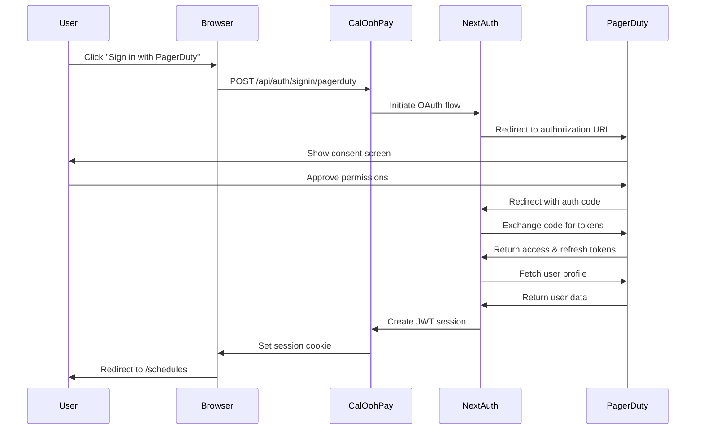
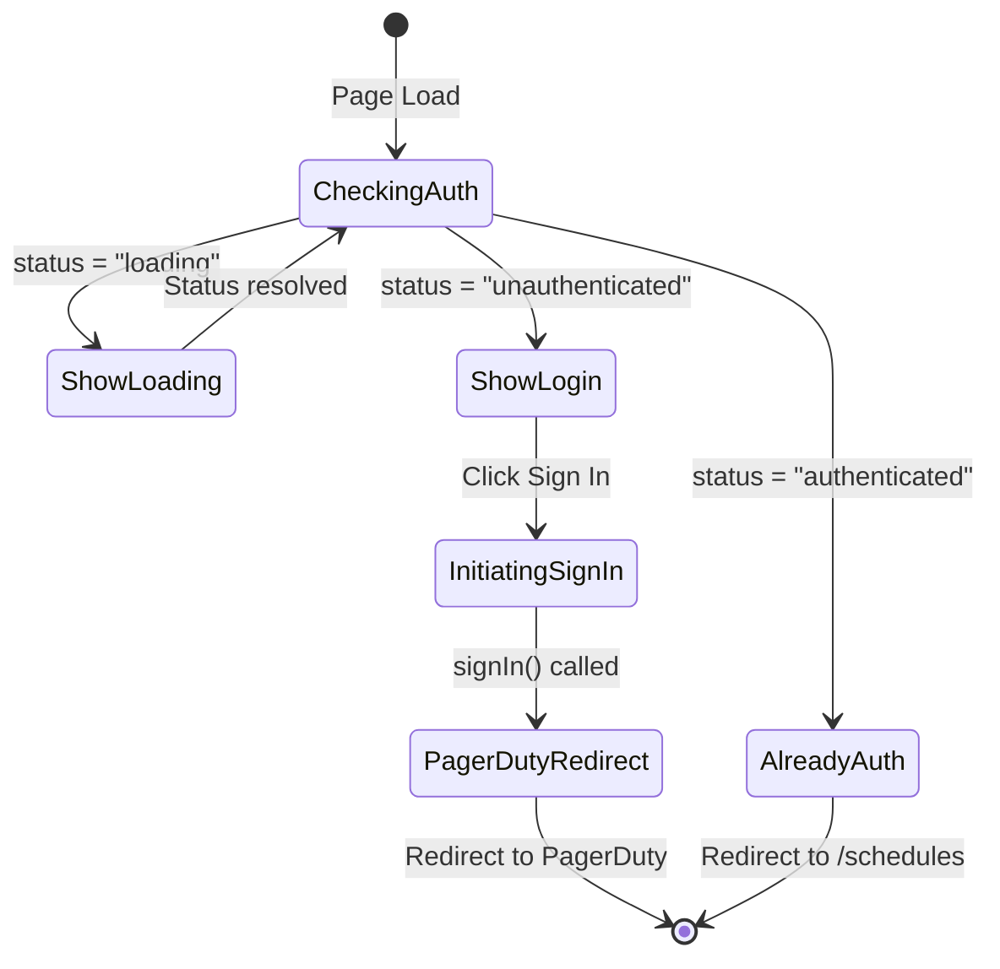
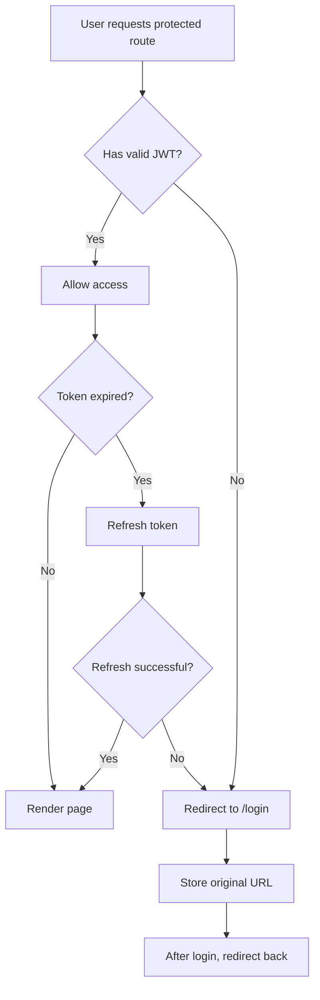
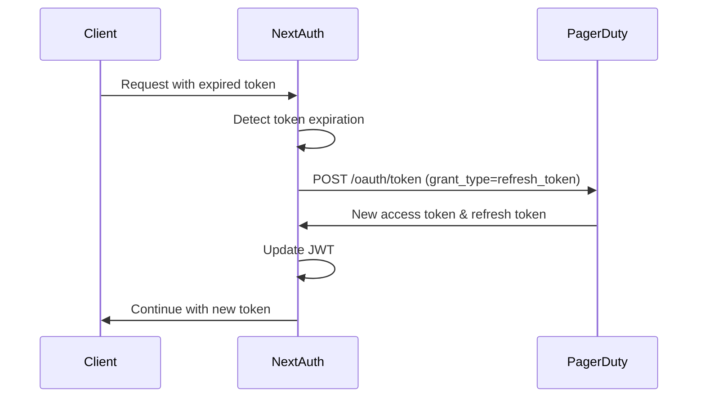

# Authentication System Documentation

## Overview

CalOohPay Web uses **NextAuth.js** for authentication with **PagerDuty OAuth 2.0** as the identity provider. This document explains the authentication flow, implementation details, and security considerations for engineers working on the project.

## Table of Contents

- [Architecture](#architecture)
- [Authentication Flow](#authentication-flow)
- [Component Structure](#component-structure)
- [Session Management](#session-management)
- [Protected Routes](#protected-routes)
- [Token Management](#token-management)
- [Security Considerations](#security-considerations)
- [Testing](#testing)
- [Troubleshooting](#troubleshooting)

---

## Architecture

### Technology Stack

- **NextAuth.js v5** - Authentication framework for Next.js
- **PagerDuty OAuth 2.0** - Identity provider
- **JWT** - Session strategy for stateless authentication
- **Next.js Middleware** - Route protection

### Key Files

```
src/
├── app/
│   ├── api/
│   │   └── auth/
│   │       └── [...nextauth]/
│   │           └── route.ts          # NextAuth API routes
│   ├── login/
│   │   └── page.tsx                  # Login page
│   └── layout.tsx                     # Root layout with SessionProvider
├── lib/
│   └── auth/
│       └── options.ts                 # NextAuth configuration
├── context/
│   └── SessionProvider.tsx            # Session context wrapper
├── middleware.ts                      # Route protection middleware
└── types/
    └── next-auth.d.ts                 # TypeScript type extensions
```

---

## Authentication Flow

### High-Level OAuth Flow



### OIDC Integration

CalOohPay uses **OpenID Connect (OIDC)** for PagerDuty authentication, which provides enhanced security over plain OAuth 2.0:

**Key OIDC Features:**

- **ID Token Validation**: PagerDuty issues signed id_tokens validated via JWKS
- **Issuer Verification**: Confirms authorization server identity (`app.pagerduty.com/global/oauth/anonymous`)
- **OpenID Scope**: Requests `openid` scope alongside `read` for OIDC flow
- **Two-Step Profile Fetch**:
  1. OIDC userinfo endpoint returns `user_id` and basic claims
  2. REST API call fetches complete user profile (name, email, avatar)

**OIDC Endpoints:**

- **Authorization**: `https://app.pagerduty.com/global/oauth/authorize`
- **Token Exchange**: `https://app.pagerduty.com/global/oauth/token`
- **Userinfo**: `https://app.pagerduty.com/global/oauth/userinfo`
- **JWKS**: `https://app.pagerduty.com/global/oauth/anonymous/jwks`
- **Issuer**: `https://app.pagerduty.com/global/oauth/anonymous`

This OIDC implementation ensures secure authentication with cryptographic validation of tokens and issuer claims.

### Detailed Step-by-Step Flow

1. **User Initiates Sign-In**
   - User clicks "Sign in with PagerDuty" button on `/login`
   - Client calls `signIn('pagerduty', { callbackUrl: '/schedules' })`

2. **Authorization Request**
   - NextAuth constructs authorization URL with required parameters:
     - `client_id`: PagerDuty application client ID
     - `redirect_uri`: Callback URL (`/api/auth/callback/pagerduty`)
     - `scope`: `read openid` (OpenID Connect scope for OIDC authentication)
     - `response_type`: `code`
     - `issuer`: `https://app.pagerduty.com/global/oauth/anonymous`
   - User is redirected to PagerDuty's OIDC authorization page

3. **User Consent**
   - PagerDuty displays consent screen showing requested permissions
   - User reviews and approves access

4. **Authorization Code Exchange**
   - PagerDuty redirects back with authorization code and issuer claim
   - NextAuth callback handler validates the issuer claim
   - Backend exchanges code for tokens via POST to `https://app.pagerduty.com/global/oauth/token`
   - Receives: access_token, refresh_token, and id_token (OIDC)

5. **User Profile Fetch (Two-Step Process)**
   - **Step 1 - OIDC Userinfo**: NextAuth fetches basic claims from OIDC userinfo endpoint
     - Returns `user_id` and basic OIDC claims
     - Validates id_token using JWKS from `https://app.pagerduty.com/global/oauth/anonymous/jwks`
   - **Step 2 - Full User Details**: Uses `user_id` to fetch complete profile
     - Calls `https://api.pagerduty.com/users/{user_id}` with Bearer token
     - Retrieves full user data: name, email, avatar_url
     - This two-step approach ensures we get both OIDC validation and complete user details

6. **JWT Creation**
   - NextAuth creates a JWT containing:
     - User information (id, name, email, image)
     - Access token for PagerDuty API calls
     - Refresh token for token renewal
     - Token expiration timestamp
   - JWT is signed with `NEXTAUTH_SECRET`

7. **Session Cookie**
   - Encrypted session cookie is set in the browser
   - Cookie is HTTP-only and secure (HTTPS only in production)
   - User is redirected to callback URL (`/schedules`)

---

## Component Structure

### NextAuth Configuration (`src/lib/auth/options.ts`)

```typescript
export const authOptions: AuthOptions = {
  providers: [PagerDutyProvider],
  pages: { signIn: '/login', error: '/login' },
  session: { strategy: 'jwt', maxAge: 30 * 24 * 60 * 60 },
  callbacks: { jwt, session },
  events: { signOut },
  debug: process.env.NODE_ENV === 'development',
};
```

**Key Configuration:**

- **Provider**: Custom PagerDuty OAuth provider
- **Session Strategy**: JWT (stateless, no database required)
- **Session Duration**: 30 days
- **Custom Pages**: Redirects to `/login` for auth errors

### JWT Callback

Handles token creation and refresh:

```typescript
async jwt({ token, account, user }) {
  // Initial sign in - store tokens
  if (account && user) {
    return {
      ...token,
      accessToken: account.access_token,
      refreshToken: account.refresh_token,
      accessTokenExpires: account.expires_at * 1000,
      user: { id, name, email, image }
    };
  }

  // Return token if not expired
  if (Date.now() < token.accessTokenExpires) {
    return token;
  }

  // Refresh expired token
  return refreshAccessToken(token);
}
```

### Session Callback

Exposes data to client:

```typescript
async session({ session, token }) {
  session.user = token.user;
  session.accessToken = token.accessToken;
  session.error = token.error;
  return session;
}
```

### Login Page Flow



---

## Session Management

### Client-Side Session Access

```typescript
import { useSession } from 'next-auth/react';

function Component() {
  const { data: session, status } = useSession();

  if (status === 'loading') return <Loading />;
  if (status === 'unauthenticated') return <Redirect to="/login" />;

  // Access user data
  const { user, accessToken } = session;

  return <div>Hello, {user.name}</div>;
}
```

### Server-Side Session Access

```typescript
import { getServerSession } from 'next-auth';
import { authOptions } from '@/lib/auth/options';

export async function GET() {
  const session = await getServerSession(authOptions);

  if (!session) {
    return new Response('Unauthorized', { status: 401 });
  }

  // Use session.accessToken for PagerDuty API calls
  return Response.json({ user: session.user });
}
```

### Session States

| State             | Description                     | UI Behavior                              |
| ----------------- | ------------------------------- | ---------------------------------------- |
| `loading`         | Session status being determined | Show loading spinner                     |
| `authenticated`   | User is signed in               | Show protected content                   |
| `unauthenticated` | No active session               | Redirect to login or show sign-in button |

---

## Protected Routes

### Middleware Protection

Routes are protected using Next.js middleware:

```typescript
// src/middleware.ts
export default withAuth(
  function middleware() {
    return NextResponse.next();
  },
  {
    callbacks: {
      authorized: ({ token }) => !!token,
    },
    pages: { signIn: '/login' },
  }
);

export const config = {
  matcher: ['/schedules/:path*', '/payments/:path*', '/dashboard/:path*'],
};
```

**Protected Routes:**

- `/schedules/*` - Schedule listing and details
- `/payments/*` - Payment calculations
- `/dashboard/*` - User dashboard

**Public Routes:**

- `/` - Home page
- `/login` - Login page
- `/api/auth/*` - NextAuth API routes

### Route Protection Flow



---

## Token Management

### Access Token Storage

- **Location**: Stored in JWT session token
- **Lifetime**: Typically 1 hour (PagerDuty default)
- **Usage**: Passed to PagerDuty API for authenticated requests

### Token Refresh Flow



### Automatic Token Refresh

Token refresh happens automatically in the JWT callback:

```typescript
async function refreshAccessToken(token: JWT): Promise<JWT> {
  try {
    const response = await fetch('https://app.pagerduty.com/global/oauth/token', {
      method: 'POST',
      body: new URLSearchParams({
        client_id: process.env.NEXT_PUBLIC_PAGERDUTY_CLIENT_ID!,
        client_secret: process.env.PAGERDUTY_CLIENT_SECRET!,
        grant_type: 'refresh_token',
        refresh_token: token.refreshToken,
      }),
    });

    const refreshedTokens = await response.json();

    return {
      ...token,
      accessToken: refreshedTokens.access_token,
      accessTokenExpires: Date.now() + refreshedTokens.expires_in * 1000,
      refreshToken: refreshedTokens.refresh_token ?? token.refreshToken,
    };
  } catch (error) {
    return { ...token, error: 'RefreshAccessTokenError' };
  }
}
```

### Using Access Token with PagerDuty API

```typescript
// In any component or API route
const { data: session } = useSession();

const response = await fetch('https://api.pagerduty.com/schedules', {
  headers: {
    Authorization: `Bearer ${session.accessToken}`,
    Accept: 'application/vnd.pagerduty+json;version=2',
  },
});
```

---

## Security Considerations

### Environment Variables

**Required Variables:**

```bash
# OAuth Credentials (Keep secret!)
NEXT_PUBLIC_PAGERDUTY_CLIENT_ID=your_client_id
PAGERDUTY_CLIENT_SECRET=your_client_secret_never_expose

# NextAuth Configuration
NEXTAUTH_URL=https://your-domain.com
NEXTAUTH_SECRET=generate_with_openssl_rand_base64_32
```

**Security Notes:**

- ✅ `NEXT_PUBLIC_*` variables are safe to expose (client-side)
- ⚠️ `PAGERDUTY_CLIENT_SECRET` must NEVER be exposed to client
- ⚠️ `NEXTAUTH_SECRET` must be strong (32+ characters, random)

### Cookie Security

NextAuth automatically configures secure cookies:

```typescript
cookies: {
  sessionToken: {
    name: `__Secure-next-auth.session-token`,
    options: {
      httpOnly: true,      // Prevents XSS attacks
      sameSite: 'lax',     // CSRF protection
      path: '/',
      secure: true,        // HTTPS only in production
    }
  }
}
```

### CSRF Protection

- NextAuth includes built-in CSRF protection
- CSRF tokens are automatically managed
- All state-changing requests require valid CSRF tokens

### XSS Prevention

- Session tokens stored in HTTP-only cookies (not accessible via JavaScript)
- User input sanitized in UI components
- Content Security Policy headers recommended

### Token Security Best Practices

1. **Never log tokens** - Avoid `console.log(session.accessToken)`
2. **Use HTTPS in production** - Enforced by secure cookies
3. **Rotate secrets regularly** - Update `NEXTAUTH_SECRET` periodically
4. **Implement rate limiting** - Prevent brute force attacks (future enhancement)
5. **Monitor failed auth attempts** - Log and alert on suspicious activity

---

## Testing

### Unit Tests

Test authentication utilities:

```typescript
// src/lib/auth/__tests__/options.test.ts
import { authOptions } from '../options';

describe('AuthOptions', () => {
  it('should have PagerDuty provider configured', () => {
    expect(authOptions.providers).toHaveLength(1);
    expect(authOptions.providers[0].id).toBe('pagerduty');
  });

  it('should use JWT session strategy', () => {
    expect(authOptions.session.strategy).toBe('jwt');
  });
});
```

### Integration Tests

Test login flow:

```typescript
// tests/e2e/auth.spec.ts
import { test, expect } from '@playwright/test';

test.describe('Authentication', () => {
  test('should redirect unauthenticated users to login', async ({ page }) => {
    await page.goto('/schedules');
    await expect(page).toHaveURL('/login');
  });

  test('should complete OAuth flow', async ({ page }) => {
    await page.goto('/login');
    await page.click('button:has-text("Sign in with PagerDuty")');

    // Mock PagerDuty OAuth flow
    // Fill in credentials
    // Verify redirect to /schedules
  });
});
```

### Manual Testing Checklist

- [ ] Sign in with valid PagerDuty credentials
- [ ] Sign in failure with invalid credentials
- [ ] Access protected route without authentication (should redirect)
- [ ] Access protected route with authentication (should allow)
- [ ] Sign out successfully
- [ ] Token refresh after expiration
- [ ] Session persistence across page refreshes
- [ ] Multiple browser tab sessions

---

## Troubleshooting

### Common Issues

#### 1. "OAuthCallback" Error

**Symptom**: Redirect loop or error after OAuth callback

**Causes**:

- Incorrect redirect URI in PagerDuty app settings
- Mismatched `NEXTAUTH_URL` environment variable

**Solution**:

```bash
# Ensure these match:
NEXTAUTH_URL=http://localhost:3000
PagerDuty Redirect URI: http://localhost:3000/api/auth/callback/pagerduty
```

#### 2. "RefreshAccessTokenError"

**Symptom**: User logged out unexpectedly

**Causes**:

- Refresh token expired
- Invalid client credentials
- PagerDuty API changes

**Solution**:

- Check PagerDuty client secret is correct
- Verify token refresh logic in `options.ts`
- Have user sign in again

#### 3. Session Not Persisting

**Symptom**: User logged out on page refresh

**Causes**:

- Cookies not being set
- `NEXTAUTH_SECRET` missing or changing
- Browser blocking cookies

**Solution**:

```bash
# Generate stable secret:
openssl rand -base64 32

# Set in .env.local:
NEXTAUTH_SECRET=<generated_secret>
```

#### 4. "AccessDenied" Error

**Symptom**: Cannot access PagerDuty resources

**Causes**:

- Insufficient OAuth scopes
- User denied permissions
- Access token invalid

**Solution**:

- Verify scopes in `options.ts`: `scope: 'read openid'` (OIDC)
- Check user has PagerDuty account access
- Have user re-authenticate

### Debug Mode

Enable NextAuth debug mode for detailed logs:

```typescript
// src/lib/auth/options.ts
export const authOptions: AuthOptions = {
  // ...
  debug: true, // Enable in development
};
```

**Debug Output Includes**:

- OAuth URLs and parameters
- Token exchange requests/responses
- Callback errors
- JWT encode/decode operations

### Logging Strategy

```typescript
// Log auth events (production-safe)
events: {
  async signIn({ user }) {
    console.log('User signed in:', user.email);
  },
  async signOut({ token }) {
    console.log('User signed out:', token.user?.email);
  },
  async error({ error }) {
    console.error('Auth error:', error);
  },
}
```

---

## API Reference

### `useSession()`

Client-side hook for session data:

```typescript
const { data: session, status, update } = useSession();
```

**Returns**:

- `session`: Session object or null
- `status`: 'loading' | 'authenticated' | 'unauthenticated'
- `update()`: Force session refresh

### `getServerSession(authOptions)`

Server-side session access:

```typescript
const session = await getServerSession(authOptions);
```

**Returns**: Session object or null

### `signIn(provider, options)`

Initiate sign-in:

```typescript
await signIn('pagerduty', {
  callbackUrl: '/schedules',
  redirect: true,
});
```

### `signOut(options)`

Sign out user:

```typescript
await signOut({
  callbackUrl: '/',
  redirect: true,
});
```

---

## Future Enhancements

- [ ] Implement rate limiting for auth endpoints
- [ ] Add email verification for additional security
- [ ] Support multiple OAuth providers (GitHub, Google)
- [ ] Implement remember me functionality
- [ ] Add audit logging for all auth events
- [ ] Session analytics and monitoring
- [ ] Implement device management

---

## Resources

- [NextAuth.js Documentation](https://next-auth.js.org/)
- [PagerDuty OAuth Documentation](https://developer.pagerduty.com/docs/app-integration-development/oauth-2-functionality/)
- [OAuth 2.0 RFC](https://datatracker.ietf.org/doc/html/rfc6749)
- [JWT Best Practices](https://datatracker.ietf.org/doc/html/rfc8725)

---

**Last Updated**: November 6, 2025  
**Maintained By**: Engineering Team
